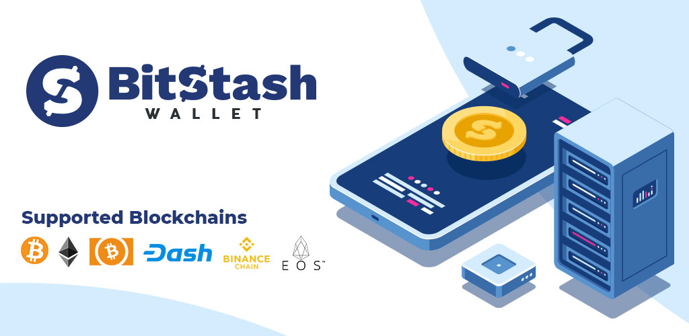
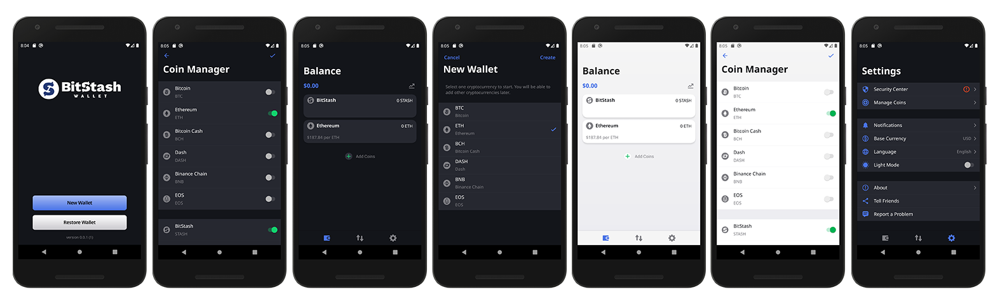

# BitStash Android Wallet - Official App
The BitStash Wallet is a dedicated cryptocurrency wallet that can be installed on android devices. Powered by services such as Infura, Horizontal Systems, Bitcoin.org, and others to interact directly with the various supported blockchains. Your wallet information is not stored with anyone except on your own device. It is important that you keep your private key backed up and secure in the event you need restore your wallet in the future.  

Want to test the mobile application on your real device? Download and install the BitStash Wallet for Android below.
  

    

## Preview Images

## Features
- Directly Connected to supported Blockchains 
- Send or Receive supported Coins & Tokens 
- QR Scanner for easy sending or receiving 
- Secure Coins & Tokens by fingerprint or pin code 
- Track price changes for holdings 
- Easy to use settings 
- Detailed Transaction page 
- Light and dark mode 
- Select base currency (Default USD) 
- Select different languages (Default English) 

## Supported Blockchains
- Bitcoin 
- Ethereum 
- Bitcoin Cash 
- Dash 
- Binance Chain 
- EOS 
- more coming soon! 

## How to add ERC-20, BEP-20, or EOS Tokens?
1. Create a new issue with the title "New Token Request".
2. Include information about your token as referenced below.

Q: Is the token ERC-20, BEP-20, or an EOS Token? 
A: ERC-20 / BEP-20 / EOS

Complete the following format with your token information. (Name -> Ticker -> Decimal -> Address) 
You can reference <a href="app/src/main/java/io/horizontalsystems/bitstashwallet/core/managers/AppConfigProvider.kt">token list file</a> for more information.

ERC-20 Tokens 
Coin("BitStash", "STASH", 18, CoinType.Erc20("0x965f109d31ccb77005858defae0ebaf7b4381652"))

BEP-20 Tokens 
Coin("Gifto", "GTO", 8, CoinType.Binance("GTO-908"))

EOS Tokens 
Coin("Newdex", "NDX", 4, CoinType.Eos("newdexissuer", "NDX"))

When submitting to add a new token, you must be affiliated and apart of the project. Please include what your token or project offers and official social media links / website. 

## How to contribute, test or use for your own project?

The best way to submit feedback and report bugs is to [open a GitHub issue](https://github.com/bitstashco/BitStash-Android-Wallet/issues/new).

This project is built with Android Studio using Java and Kolten.

1. Install Android Stuido
2. Install Android NDK
3. Fork, Clone or Download this Repo
4. Open the project folder in Android Studio
5. Build

# Help us add some new features!

Fork, clone, or download this repo and launch in android studio. We are working on adding more features to the BitStash Wallet, with your help we can make improvements faster! View below a list of coming soon features and improvements we are working on.

- Dapp Browser
- Add more blockchains
- Create a dedicated business owners app / wallet with point of sale
- Intergrate Tap-to-Pay for sending coins and tokens
- Open to user submitted intergrations and improvements

Have you improved the code or included a new feature? Create a pull request and be a part of the BitStash Wallet development today!
